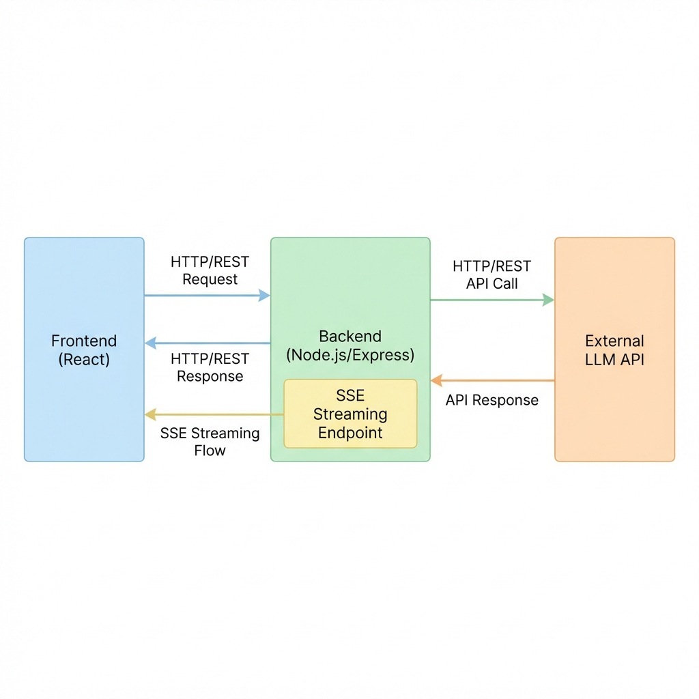

# System Explanation Document

## Overview
This document describes the **actual** architecture of the FlipAssignment application. Only the components that exist in the codebase are included:
- **Frontend** – React SPA
- **Backend** – Node.js with Express
- **Server‑Sent Events (SSE)** for streaming chat responses
- **External LLM API** for AI‑generated answers

---

## 1. Frontend (React)
- **Technology**: React (JavaScript) using functional components and hooks.
- **Responsibilities**:
  - Render the chat UI and display messages.
  - Send HTTP `POST /api/chat` requests for regular replies.
  - Open an SSE connection (`/api/chat/stream`) to receive streamed responses.
  - Show metrics (latency) returned by the backend.
- **Key Libraries**: `axios` for HTTP calls, `react-markdown` for rendering markdown, and standard React tooling.

---

## 2. Backend (Node.js / Express)
- **Technology**: Node.js runtime with the Express framework.
- **Endpoints**:
  - `POST /api/chat` – non‑streaming chat request.
  - `POST /api/chat/stream` – SSE streaming endpoint.
  - `POST /api/clear` – clear conversation memory.
  - `GET /health` – health‑check.
- **Core Logic**:
  - Initializes the AI agent (`initializeAgent`).
  - Calls the external LLM API via `processQuery` or `processQueryStream`.
  - Returns JSON responses for non‑streaming calls and SSE events for streaming calls.

---

## 3. Server‑Sent Events (SSE)
- **Purpose**: Provide a low‑overhead, unidirectional streaming channel from backend to frontend.
- **Flow**:
  1. Frontend opens an `EventSource` to `/api/chat/stream`.
  2. Backend sets `Content‑Type: text/event-stream` and writes `data:` chunks as they arrive from the LLM.
  3. The stream ends with a `[DONE]` marker.
- **Advantages**: Simpler than WebSockets for one‑way streaming, works over standard HTTP, and is already used in the code.

---

## 4. External LLM API
- **Role**: Generates the actual answer content.
- **Integration**:
  - Backend makes HTTPS POST requests to the configured LLM provider.
  - Handles rate‑limiting and error handling.
  - Streams partial results back to the client via SSE.

---

## 5. Latency Management
The system employs several strategies to minimize response time and improve the perceived speed:
- **Server‑Sent Events (SSE) Streaming**: By streaming the response, the system reduces the **Time to First Token (TTFT)**. The user sees the answer being typed in real‑time rather than waiting for the entire generation to complete.
- **In‑Memory History**: Conversation history is managed in memory on the backend, avoiding slow database round‑trips for context retrieval during a session.
- **Context Window Optimization**: The system limits the number of historical messages sent to the LLM (`historyLimit`). This keeps the prompt size manageable and ensures faster processing by the model.
- **Latency Monitoring**: Every request tracks and reports two metrics:
  - `agentLatency`: Time taken by the AI agent to process and generate the response.
  - `totalLatency`: Total time from the moment the request hits the server until it is completed.
- **Optimized Tooling**: Web search results are capped (`maxResults`) to ensure that external data fetching doesn't become a bottleneck.

---

## 6. Diagram
The diagram above visualizes the data flow:
- **HTTP/REST** calls for normal chat (`/api/chat`).
- **SSE** flow for streaming responses (`/api/chat/stream`).
- Interaction with the **LLM API** from the backend.

---

## Summary
The current system is lightweight and focused:
- A React frontend communicates with an Express backend.
- Real‑time streaming is achieved with Server‑Sent Events.
- All AI generation is delegated to an external LLM service.
- Latency is actively managed through streaming, memory optimization, and prompt engineering.

Feel free to extend the architecture (e.g., add authentication, a database, or Docker) as the project evolves.
